# 《数字媒体技术基础》大作业 —— 智能换脸软件

## 1 要求：

**软件部分 50 分：**
 需提交完整的可运行的源程序，并附上 Readme 程序说明文件（注释关键程序和算法，附上软件界面和部分结果）,将会根据关键算法代码+效果+界面进行评分。

**选择选题：智能换脸软件**
功能要求：
已知一幅 A 的人脸图像或人脸视频，新输入一张 B 的人脸图像，将 A 的图像或者视
频自动地换成 B 的人脸。

- 建议技术路线： 人脸检测+人脸图像迁移。
- 关键创新部分： 人脸图像迁移技术。
  评分标注：
- 软件部分： 人脸图像转换部分+人脸图像检测部分+效果+界面等 50 分。

## 2 程序功能介绍

程序基于 OpenCV 和 dlib 完成了以下的功能：

1. 已知一幅 A 的人脸图像，新输入一张 B 的人脸图像，将 A 的图像自动地换成 B 的人脸。
2. 已知一幅 A 的人脸视频，新输入一张 B 的人脸图像，将 A 的视频自动地换成 B 的人脸。

## 3 关键程序和算法（包括详细注释)

### 3.1 人脸监测（face_detect)

传统方法的第一步是找到面部特征点（地标），所以我们有面部地标之间一一对应。这使用面部标志而不是使用所有点的原因面是为了降低计算复杂度。用于检测我们使用内置于 OpenCV 中的 dlib 库的面部标志。我们这里直接导入它的检测器和面部特征提取器进行使用。
**下面是导入的代码以及详细的注释：**

```python
PREDICTOR_PATH = 'models/shape_predictor_68_face_landmarks.dat'
# 加载面部检测器
detector = dlib.get_frontal_face_detector()
# 加载训练模型并获取面部特征提取器
predictor = dlib.shape_predictor(PREDICTOR_PATH)
```

其中：
predictor 需要一个粗边界框作为算法的输入，由 detector 提供的，detector 返回一个矩形列表，每个矩形对应于图像中的一个人脸。

```python
# 人脸检测
def face_detection(img):
    """
    让检测器找到每个人脸的边界框。 第二个参数中的 1
    表示我们应该对图像进行 1 次上采样。
    这将使一切变得更大，并使我们能够检测到更多的面孔。
    """
    # 进行人脸检测，获得人脸框的位置信息
    rects = detector(img, 1)
    if len(rects) > 1:
        raise RuntimeError("Too many faces")
    if len(rects) == 0:
        raise RuntimeError("no faces")
    return rects

## 人脸特征点检测
def face_points_detection(img, bbox:dlib.rectangle):
    # 获取框 d 中面部特征点
    shape = predictor(img, bbox)
    # 循环遍历 68 个面部标志并将它们转换为(x, y)坐标的2元组
    # 返回(x, y)坐标数组，输入图像的每个特征点对应每行的一个x，y坐标
    return numpy.asarray(list([p.x, p.y] for p in shape.parts()), dtype=numpy.int)

```

### 3.2 人脸替换（face_swap）

主程序调用人脸替换文件程序是通过调用一下函数实现的，该函数的输入脸为人脸检测后提取的人脸以及相关参数。
**函数附带有详细的注释：**

```python
def face_swap(srcFace, dstFace, srcPoints, dstPoints, dstShape, dstImg, end=48):
    h, w = dstFace.shape[:2]

    # 3d 映射
    warpedSrcFace = warp_image_3d(
        srcFace, srcPoints[:end], dstPoints[:end], (h, w))
    # 生成一个遮罩,表示换脸区间
    mask = getFaceMask((h, w), dstPoints)
    maskSrc = numpy.mean(warpedSrcFace, axis=2) > 0
    mask = numpy.asarray(mask * maskSrc, dtype=numpy.uint8)
    # 图像位与运算，扣出遮罩罩住的区间
    warpedSrcFace = cv2.bitwise_and(warpedSrcFace, warpedSrcFace, mask=mask)
    # 图像位与运算，扣出遮罩罩住的区间
    dstFaceMasked = cv2.bitwise_and(dstFace, dstFace, mask=mask)
    # 矫正颜色
    warpedSrcFace = correct_colours(dstFaceMasked, warpedSrcFace, dstPoints)

    # 泊松混合
    # 使用 cv2.seamlessClone以目标脸部作为背景，将罩住并调整后的源脸同色系的嵌入
    r = cv2.boundingRect(mask)
    center = ((r[0] + int(r[2] / 2), r[1] + int(r[3] / 2)))
    output = cv2.seamlessClone(
        warpedSrcFace, dstFace, mask, center, cv2.NORMAL_CLONE)

    # 返回结果图片
    x, y, w, h = dstShape
    dstImgCopy = dstImg.copy()
    dstImgCopy[y:y + h, x:x + w] = output

    return dstImgCopy
```

**该换脸过程依次如下：**

#### 3.2.1 使用三角测量的面部变形（warp_image_3d）

使用 Delaunay 三角剖分来实现,大致过程如下：

1. 采取平均特征点并执行 delaunay 三角剖分
2. 对于目标/目标面 B 中的每个三角形，计算每个像素的重心坐标
3. 确定图像 B 中的哪些点位于内部
   通过应用以下约束来创建三角形：
   • α 2 [0; 1], β 2 [0; 1], γ 2 [0; 1],
   • α + β + γ = 1
   得到与位于三角形内的点相对应的过滤后的重心坐标
4. 在源图像 A 中使用过滤后的重心进一步计算对应的像素位置
5. 我们将像素的值复制回(xA; yA) 到目标位置

**相关代码块以及详细注释如下：**

```python

## 3D Transform 双线性插值：在每个图像通道上进行插值
def bilinear_interpolate(img, coords):
    # 变量img: 最多 3 通道图像
    # 变量coords: 2行数组。 第一行 = xcoords，第二行 = ycoords
    # 返回值 与坐标形状相同的内插像素数组

    intCoords = numpy.int32(coords)
    x0, y0 = intCoords
    dx, dy = coords - intCoords

    # 4相邻像素
    q11 = img[y0, x0]
    q21 = img[y0, x0 + 1]
    q12 = img[y0 + 1, x0]
    q22 = img[y0 + 1, x0 + 1]

    btm = q21.T * dx + q11.T * (1 - dx)
    top = q22.T * dx + q12.T * (1 - dx)
    interPixel = top * dy + btm * (1 - dy)

    return interPixel.T

## 所提供点的 ROI 内的 x,y 网格坐标
def grid_coordinates(points):
    #变量points: 生成网格坐标的点
    # 返回值 (x, y) 坐标数组
    xmin = numpy.min(points[:, 0])
    xmax = numpy.max(points[:, 0]) + 1
    ymin = numpy.min(points[:, 1])
    ymax = numpy.max(points[:, 1]) + 1

    return numpy.asarray([(x, y) for y in range(ymin, ymax)
                          for x in range(xmin, xmax)], numpy.uint32)

## 仅在目标图像的 ROI 内（dstPoints 中的点）扭曲来自 src_image 的每个三角形。
def process_warp(srcImg, resultImg, triAffines, dstPoints, delaunay):

    roiCoords = grid_coordinates(dstPoints)
    # 顶点的索引。 -1 如果像素不在任何三角形中
    roiTriIndices = delaunay.find_simplex(roiCoords)

    for simplexIndex in range(len(delaunay.simplices)):
        coords = roiCoords[roiTriIndices == simplexIndex]
        numCoords = len(coords)
        outCoords = numpy.dot(triAffines[simplexIndex],
                              numpy.vstack((coords.T, numpy.ones(numCoords))))
        x, y = coords.T
        resultImg[y, x] = bilinear_interpolate(srcImg, outCoords)

    return None

## 计算每个的仿射变换矩阵,从 dstPoints 到 srcPoints 的三角形 (x,y) 顶点
def triangular_affine_matrices(vertices, srcPoints, dstPoints):
    #变量vertices: 三角形角的三元组索引数组
    # 变量srcPoints: [x, y] 数组指向源图像的地标
    # 变量dstPoints: [x, y] 数组指向目标图像的地标
    # 返回三角形的 2 x 3 仿射矩阵变换
    ones = [1, 1, 1]
    for triIndices in vertices:
        srcTri = numpy.vstack((srcPoints[triIndices, :].T, ones))
        dstTri = numpy.vstack((dstPoints[triIndices, :].T, ones))
        mat = numpy.dot(srcTri, numpy.linalg.inv(dstTri))[:2, :]
        yield mat

# 使用三角测量的面部变形，使用 Delaunay 三角剖分来实现
def warp_image_3d(srcImg, srcPoints, dstPoints, dstShape, dtype=numpy.uint8):
    # 对两幅图像进行三角剖分：
    rows, cols = dstShape[:2]
    resultImg = numpy.zeros((rows, cols, 3), dtype=dtype)
    # 使用了 getTriangleList() 函数cv2.Subdiv2D 类 OpenCV 实现 Delaunay三角测量
    delaunay = spatial.Delaunay(dstPoints)
    triAffines = numpy.asarray(list(triangular_affine_matrices(
        delaunay.simplices, srcPoints, dstPoints)))

    process_warp(srcImg, resultImg, triAffines, dstPoints, delaunay)

    return resultImg
```

#### 3.2.2 使用上一步面部变形后的结果生成一个遮罩（getFaceMask），表示换脸区间

**相关代码以及详细注释如下：**

```python
## 绘制凸包
def drawConvexHull(im, points, color):
    # 使用cv2.convexHull获得位置的凸包位置
    points = cv2.convexHull(points)
    # 绘制好多边形后并填充,点的顺序不同绘制出来的凸包也不同
    cv2.fillConvexPoly(im, points, color=color)

## 生成遮罩
def getFaceMask(size, points, erodeFlag=1):
    # 定义是为一张图像和一个标记矩阵生成一个遮罩，它
    # 画出了两个白色的凸多边形：一个是眼睛周围的区域，一
    # 个是鼻子和嘴部周围的区域。之后它由11个像素向
    # 遮罩的边缘外部羽化扩展，可以帮助隐藏任何不连续的区域。

    radius = 10  # kernel size
    kernel = numpy.ones((radius, radius), numpy.uint8)

    mask = numpy.zeros(size, numpy.uint8)
    drawConvexHull(mask, points, 255)
    if erodeFlag:
        mask = cv2.erode(mask, kernel, iterations=1)

    return mask
```

#### 3.2.3 对源人脸和目的人脸进行图像位与运算，扣出遮罩罩住的区间（bitwise_and）

**相关代码如下：**

```python
    warpedSrcFace = cv2.bitwise_and(warpedSrcFace, warpedSrcFace, mask=mask)
    # 图像位与运算，扣出遮罩罩住的区间
    dstFaceMasked = cv2.bitwise_and(dstFace, dstFace, mask=mask)
    # 矫正颜色
    warpedSrcFace = correct_colours(dstFaceMasked, warpedSrcFace, dstPoints)
```

#### 3.2.4 矫正颜色(correct_colours)

将矫正扣出的源人脸的颜色和目的人脸的相同，它通过用 im2 乘以 im1 的高斯模糊值然后除以 im2 的高斯模糊值，用 RGB 缩放校色，但是不是用所有图像的整体常数比例因子，每个像素都有自己的局部比例因子，用这种方法两图像之间光线的差异只能在某种程度上被修正

解决这个问题，我们可以选择一个适当的高斯内核大小（如果太小，第一个图像的面部特征将显示在第二个图像中。过大，内核之外区域像素被覆盖，并发生变色）

这里的内核用了一个 0.75 \*的瞳孔距离。
**相关代码如下：**

```python
# 色彩校正
#COLOUR_CORRECT_BLUR_FRAC=0.75
def correct_colours(im1, im2, landmarks1):
    # 用RGB缩放校色
    blurAmount = COLOUR_CORRECT_BLUR_FRAC * numpy.linalg.norm(
        numpy.mean(landmarks1[LEFT_EYE_POINTS], axis=0) -
        numpy.mean(landmarks1[RIGHT_EYE_POINTS], axis=0))
    blurAmount = int(blurAmount)
    if blurAmount % 2 == 0:
        blurAmount += 1
    im1Blur = cv2.GaussianBlur(im1, (blurAmount, blurAmount), 0)
    im2Blur = cv2.GaussianBlur(im2, (blurAmount, blurAmount), 0)

    # 避免被零除错误
    im2Blur = im2Blur + 128 * (im2Blur <= 1.0)
    # 用 im2乘以im1的高斯模糊值然后除以 im2 的高斯模糊值
    return numpy.clip(im2.astype(numpy.float64) * im1Blur.astype(numpy.float64) / im2Blur.astype(numpy.float64), 0, 255).astype(numpy.uint8)
```

### 3.2.5 使用泊松混合，源图像正确的根据目标图像改变面部的颜色并嵌入

使用 cv2.seamlessClone 以目标脸部作为背景，将罩住并调整后的源脸同色系的嵌入
**相关代码如下：**

```python
    #center：dst中src的中心位置
    r = cv2.boundingRect(mask)
    center = ((r[0] + int(r[2] / 2), r[1] + int(r[3] / 2)))
    output = cv2.seamlessClone(
        warpedSrcFace, dstFace, mask, center, cv2.NORMAL_CLONE)
```

### 3.3 图片之间的人脸替换运行主程序（main_imgs.py)

该程序通过 tkinter 生成一个供用户与程序进行交互的图像界面，该界面如下：
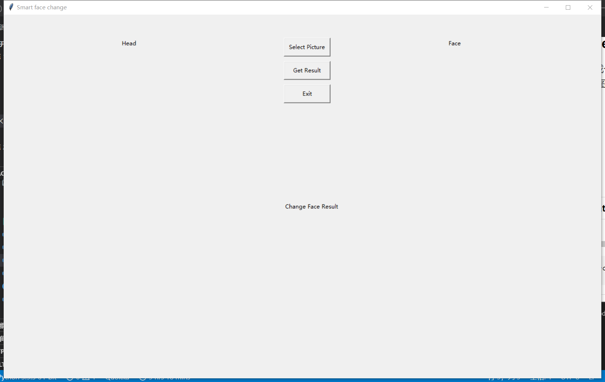

1. 点击 select Picture 触发程序调用函数`ChoosePicFileOrGetResult(1)`,来选择两张图片分别作为目的照片和源照片，并显示在指定文字（head，face）的下方
2. 点击 Get Result 触发程序调用函数`ChoosePicFileOrGetResult(2)`,来得到结果文件，保存结果文件到指定目录中（result_imgs 文件夹）并显示在指定文字 Change Face Result 的下方。
3. 点击 Exit 程序退出。

**ChoosePicFileOrGetResult 函数的源代码以及详细注释如下：**

```python
# 实现在本地电脑选择图片或者生成换脸图片结果
def ChoosePicFileOrGetResult(option):
    # 在本地电脑选择图片文件
    def ChoosePicFile():
        select_file = tkinter.filedialog.askopenfilename(title='选择图片')
        e.set(select_file)
        load = Image.open(select_file)
        load = transforms.Resize((300, 400))(load)

        global original
        original = load
    # 在界面的(placeX, placeY)显示该照片
    def showPic(placeX, placeY):
        global original
        render = ImageTk.PhotoImage(original)
        img2 = tkinter.Label(window, image=render)
        img2.image = render
        img2.place(x=placeX, y=placeY)
    # 保存照片
    def savePic(saveIm):
        str1 = pic1Pth[-6:-4]
        str2 = pic2Pth[-6:-4]
        cv2.imwrite(
            './result_imgs/from_p{}_and_p{}.jpg'.format(str1, str2), saveIm)
        load = Image.open(
            './result_imgs/from_p{}_and_p{}.jpg'.format(str1, str2))#写入照片到指定的路径中
        load = transforms.Resize((300, 400))(load)

        global original
        original = load

    if(option == 1):  # 两张选择源图片文件
        ChoosePicFile() # 选择头部照片（目的照片）
        showPic(100, 100)#在指定位置展示照片
        global dstImg, dstPoints, dstShape, dstFace, pic1Pth
        pic1Pth = e.get()# 得到选择照片的路径
        dstImg = cv2.imread(e.get())#读取照片
        dstPoints, dstShape, dstFace = face_detect.select_face(dstImg)#提取照片中的脸部

        ChoosePicFile()# 选择脸部照片（源照片）
        showPic(800, 100)#在指定位置展示照片
        global srcImg, srcPoints, srcShape, srcFace, pic2Pth
        pic2Pth = e.get()# 得到选择照片的路径
        srcImg = cv2.imread(e.get())#读取照片
        srcPoints, srcShape, srcFace = face_detect.select_face(srcImg)#提取照片中的脸部
        if srcPoints is None or dstPoints is None:#如果两张照片中有一张没有脸部则打印no face并退出程序
            print('NO Face !!!')
            exit(-1)
        global isLoadTwoPic
        isLoadTwoPic = 1#表示已经成功加载照片

    if(option == 2 and isLoadTwoPic == 1):  # 在已经选择源头文件的基础上，生成换脸图片结果
        output = face_swap.face_swap(
            srcFace, dstFace, srcPoints, dstPoints, dstShape, dstImg)
        savePic(output)
        showPic(450, 450)


```

### 3.4 图片和视频之间的人脸替换运行主程序（main_video.py)

该程序通过 tkinter 生成一个供用户与程序进行交互的图像界面，该界面如下：

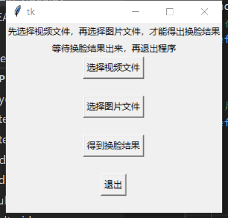

按照要求依次选择文件就可以运行程序了，注意退出需要在视频生成后再退出，防止视频损坏。
其中“选择视频文件”的按钮调用函数`ChoosePicFileOrGetResult(1)`,“选择图片文件"的按钮调用函数`ChoosePicFileOrGetResult(2)`,“得到换脸结果"的按钮调用函数`ChoosePicFileOrGetResult(3)`

**ChoosePicFileOrGetResult 函数以及详细注释如下：**

```python

## 实现在本地电脑选择图片和视频或者生成换脸视频结果
def ChoosePicFileOrGetResult(option):
    # 在本地电脑选择未被换脸的图片文件
    def ChooseFile():
        select_file = tkinter.filedialog.askopenfilename(title='选择图片')
        e.set(select_file)

    # 启动换脸程序并将换脸结果保存
    def swapPicandVideo():
        if srcPoints is None:
            print('No face detected in the source image !!!')
            exit(-1)
        str1 = picPth[-6:-4]
        str2 = videoPth[-6:-4]
        #使用cv2.VideoWriter初始化并生成写入对象，写入的目的路径文件为指定的filename的值。
        writer = cv2.VideoWriter(
            filename="./result_videos/from_p{}_and_v{}.mp4".format(str1, str2),
            fourcc=cv2.VideoWriter_fourcc('m', '2', 'v', '1'),
            frameSize=(int(video.get(cv2.CAP_PROP_FRAME_WIDTH)),
                       int(video.get(cv2.CAP_PROP_FRAME_HEIGHT))),
            fps=25.0,
            isColor=True)
        #当视频还在执行时候
        while video.isOpened():
            if cv2.waitKey(1) & 0xFF == ord('q'):
                break
            ret, frame_in = video.read()#读取当前页面的视频帧（图片）
            if ret == True:
                _, dst_img = video.read()#读取当前页面的视频帧（图片）
                #提取该图片中的人脸
                dstPoints, dstShape, dst_face = face_detect.select_face(
                    dst_img, choose=False)
                if dstPoints is not None:
                    #如果存在人脸则进行该图片的换脸
                    dst_img = face_swap.face_swap(
                        srcFace, dst_face, srcPoints, dstPoints, dstShape, dst_img, 68)
                #把换脸结果写入到视频中
                writer.write(dst_img)
                #展现该结果
                cv2.imshow("Video", dst_img)
            else:
                #资源释放
                video.release()
                writer.release()
                cv2.destroyAllWindows()
                break

    if(option == 1):  # 选择视频
        ChooseFile()#选择视频文件
        global video, videoPth
        videoPth = e.get()#读取视频路径
        video = cv2.VideoCapture(e.get())#读取视频文件
        global isLoadPicAndVideo
        isLoadPicAndVideo += 1#表示已经加载好时评

    if(option == 2): # 选择图片
        ChooseFile()#选择文件
        global srcImg, srcPoints, srcShape, srcFace, picPth
        picPth = e.get()#读取图片路径
        srcImg = cv2.imread(e.get())#读取图片文件
        srcPoints, srcShape, srcFace = face_detect.select_face(srcImg)
        if srcPoints is None:#当图片中没有检测到脸部时，打印no face并退出程序
            print('No face')
            exit(-1)
        isLoadPicAndVideo += 1

    if(option == 3 and isLoadPicAndVideo == 2):
        # 在已经选择源头文件的基础上，生成换脸视频结果
        swapPicandVideo()

```

## 4 运行说明

通过命令`python main_imgs.py`调用两个图片之间的换脸程序；
通过命令`python main_video.py`调用图片应用到视频上的换脸程序

## 5 结果呈现

### 5.1 图像之间的换脸：

#### 样例一：

点击“Select Picture”按钮，选择 material_imgs 文件假中的 pic3 作为源图片和 pic4 作为目的图片如下：
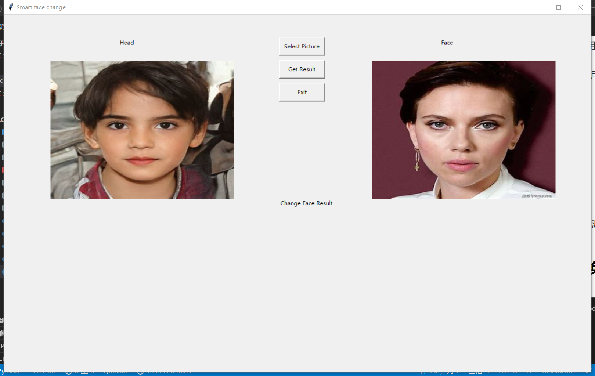
点击“Get Result”按钮，运行换脸程序，显示的换脸结果如下：
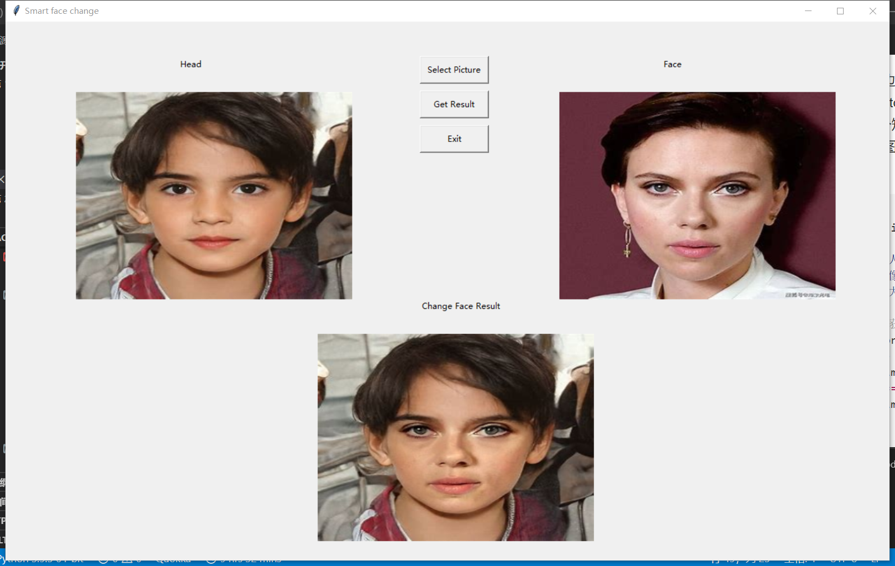

#### 样例二：

点击“Select Picture”按钮，选择 material_imgs 文件假中的 pic9 作为源图片和 pic1 作为目的图片如下：
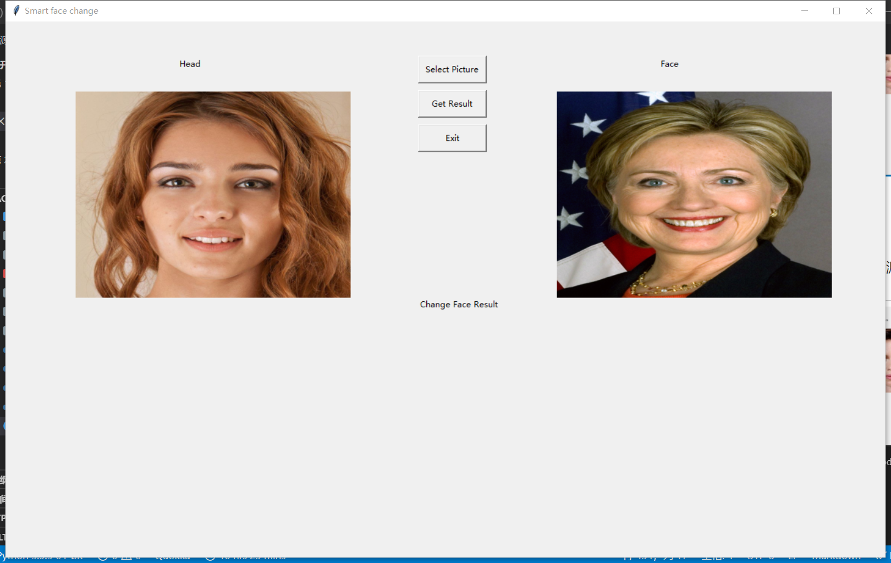
点击“Get Result”按钮，运行换脸程序，显示的换脸结果如下：
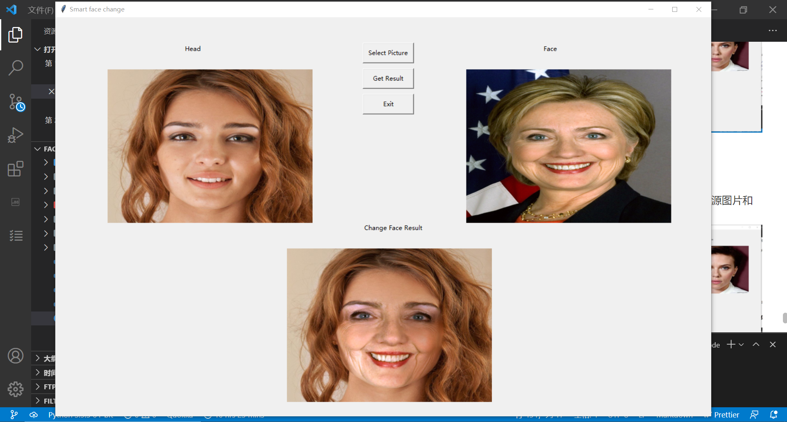

#### 样例三：

点击“Select Picture”按钮，选择 material_imgs 文件假中的 pic5 作为源图片和 pic8 作为目的图片如下：
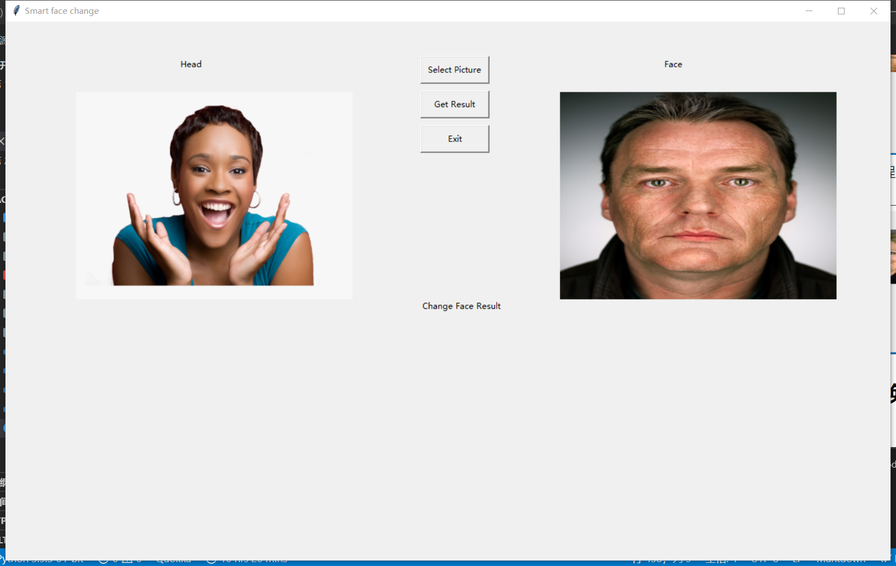
点击“Get Result”按钮，运行换脸程序，显示的换脸结果如下：
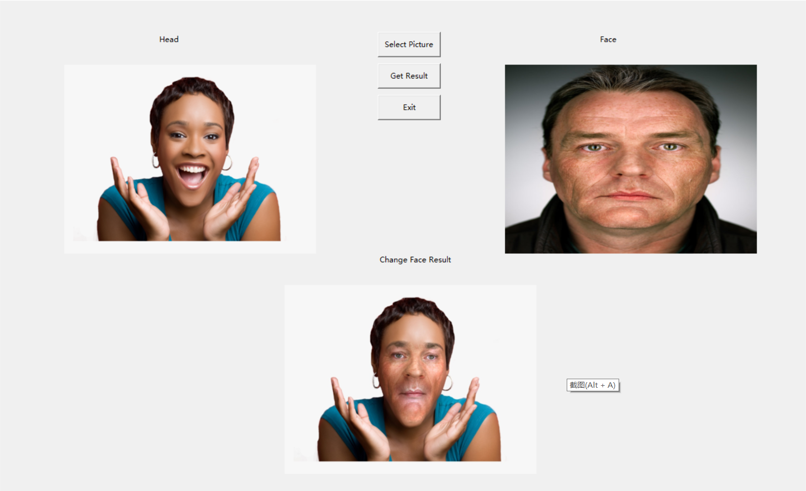

### 5.2 图像与视频之间的换脸：

#### 样例一：

再窗口交互界面上点击选择 material_videos 文件夹下的 video1.mp4 文件和 material_imgs 文件假中的 pic9 作为源图片，合成的换脸视频文件 from_p09_and_v01.mp4 位于文件夹 result_videos 下。
生成换脸视频的过程中，视频同步播放，播放截图如下：
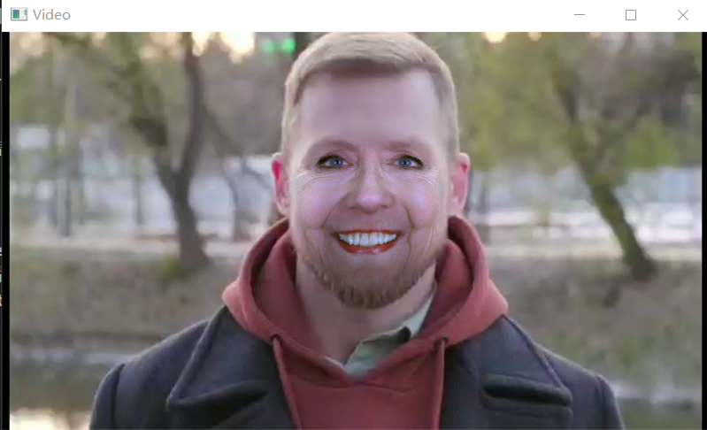

#### 样例二：

再窗口交互界面上点击选择 material_videos 文件夹下的 video1.mp4 文件和 material_imgs 文件假中的 pic5 作为源图片，合成的换脸视频文件 from_p05_and_v01.mp4 位于文件夹 result_videos 下。
生成换脸视频的过程中，视频同步播放，播放截图如下：
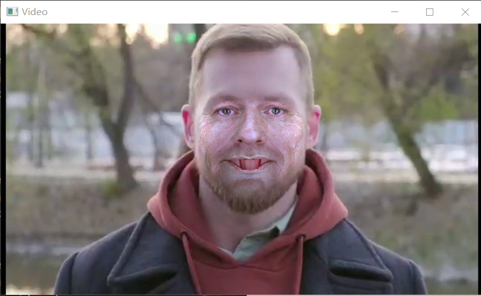

#### 样例三：

再窗口交互界面上点击选择 material_videos 文件夹下的 video2.mp4 文件和 material_imgs 文件假中的 pic3 作为源图片，合成的换脸视频文件 from_p03_and_v02.mp4 位于文件夹 result_videos 下。
生成换脸视频的过程中，视频同步播放，播放截图如下：
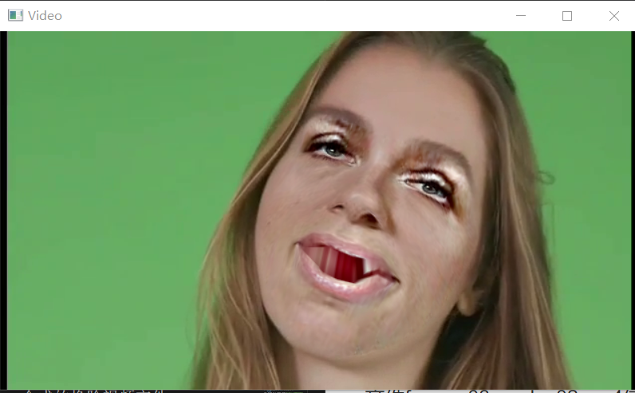
